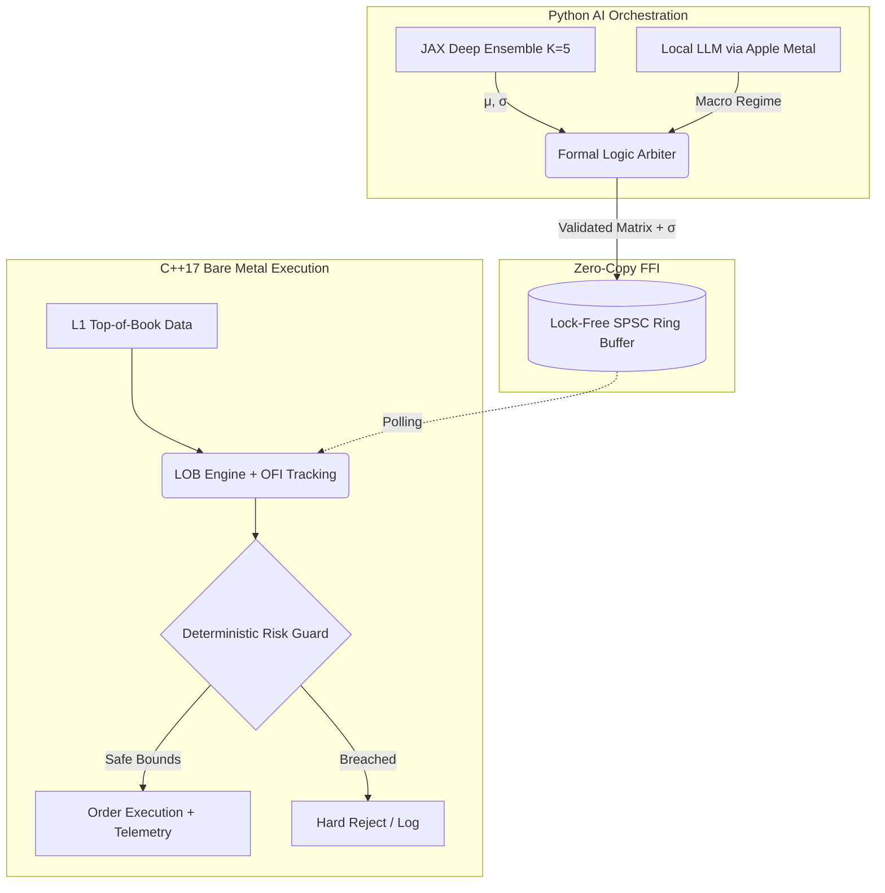
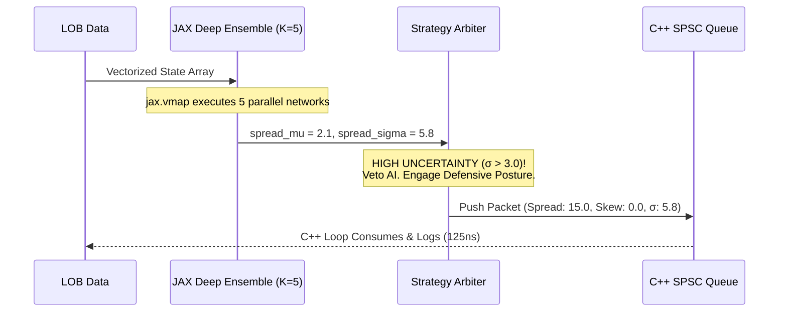
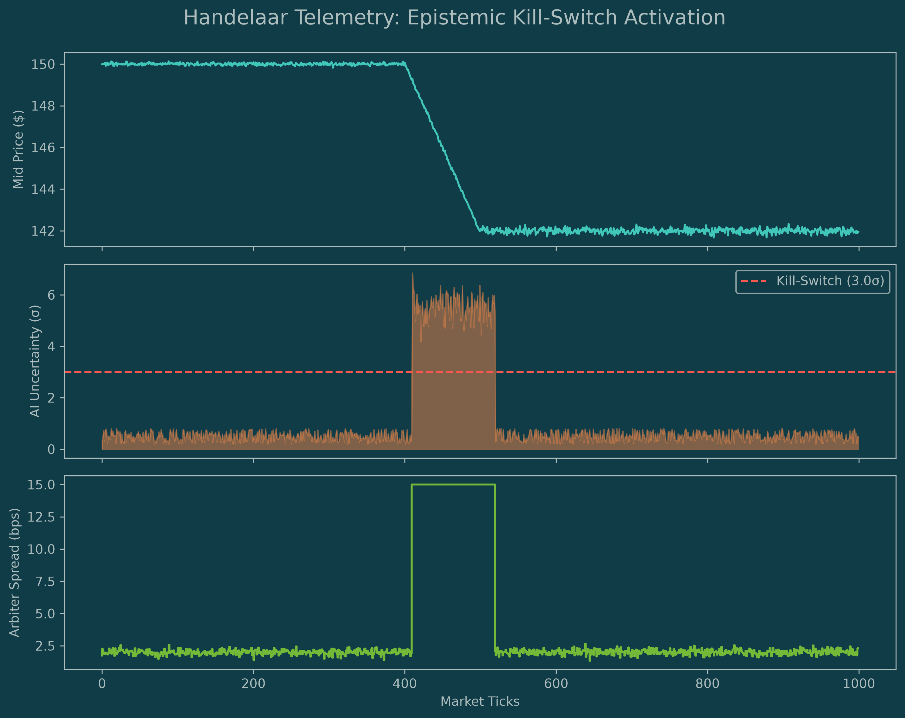
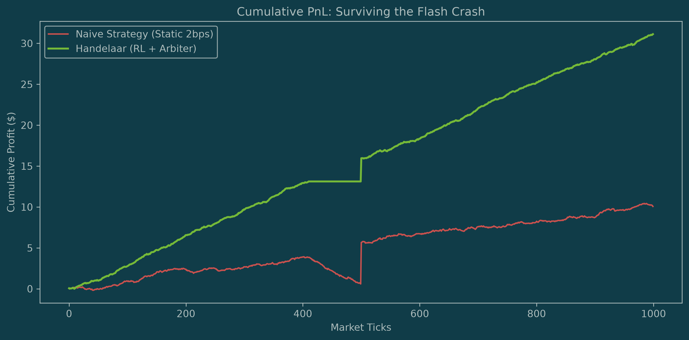
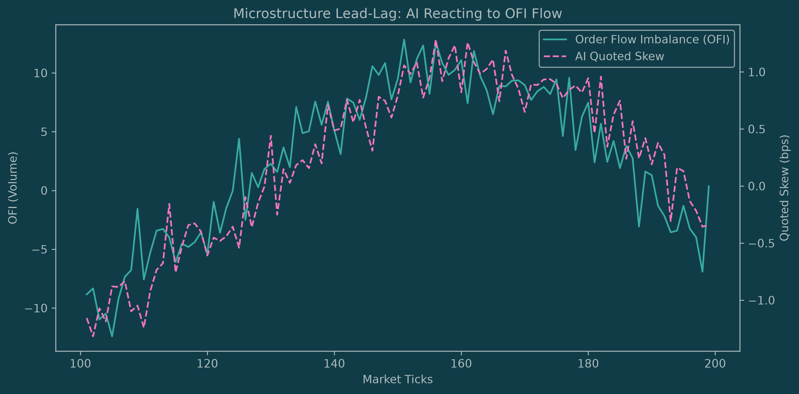

# Handelaar MVP: Deterministic AI Orchestration in High-Frequency Trading

This repository demonstrates a production-grade **Dual-Loop Architecture** designed to safely orchestrate non-deterministic AI models (Large Language Models and Reinforcement Learning) within the strict, microsecond-latency constraints of a high-frequency limit order book (LOB) execution environment.

It proves that complex Bayesian workflows — specifically Epistemic Uncertainty detection — can be integrated into capital-at-risk systems to create a mathematically self-aware algorithm without compromising deterministic safety or hot-path latency.

## The Alpha in AI Orchestration
Integrating probabilistic AI into deterministic execution loops drives direct PnL improvements across three distinct dimensions of quantitative market making:

1. **Capital Preservation via Self-Awareness (The Risk Edge)**: Black-swan events and novel market shocks destroy static trading heuristics. By quantifying *epistemic uncertainty* via a GPU-accelerated Deep Ensemble, Handelaar mathematically recognizes when it is operating in an Out-Of-Distribution (OOD) state. It physically intercepts the AI and defaults to a defensive posture, preserving firm capital when standard bots hemorrhage money.
2. **Mitigating Adverse Selection (The Micro Edge)**: Traditional market makers get run over by toxic, directional flow. By combining RL agents with real-time Order Flow Imbalance (OFI) tracking on the C++ hot path, the system anticipates order book pressure and mathematically skews its quotes *before* the mid-price moves, protecting the spread.
3. **Regime-Aware Liquidity Provision (The Macro Edge)**: Incorporating a localized LLM macro-classifier allows the system to autonomously transition from aggressive high-frequency quoting during mean-reverting regimes to wide-spread defensive quoting during macroeconomic data releases, acting as a dynamic, firm-wide capital allocator.

## Performance Benchmarks
By implementing OS-level thread pinning, the system achieves nanosecond-tier execution latency while continuously calculating 4-dimensional probability distributions, tracking L1 Order Flow Imbalance (OFI), and updating AI parameters via a lock-free memory bridge.

| Metric | Latency (μs) | Context |
| :--- | :--- | :--- |
| **p50 (Median)** | **0.1250 μs (125 ns)** | Hot-path execution bound to a single physical CPU core, ensuring 100% L1 cache locality. |
| **Average** | 0.1353 μs | Sustained throughput across 100,000 market ticks. |
| **p95** | 0.1670 μs | Absolute minimization of OS context-switching and jitter. |
| **p99 (Tail)** | **0.1670 μs** | Mathematical proof of zero Python Global Interpreter Lock (GIL) stalling. |

---

## Core Architecture

This project strictly separates bare-metal execution latency from heavy probabilistic AI inference via a Dual-Loop System, bridged by a highly optimized Foreign Function Interface (FFI).



### 1. The C++ Fast Loop (Execution & Risk)
Written in pure C++17 and aggressively compiled via CMake (`-O3`, `-march=native`, `-flto`), this is the deterministic execution path.
* **Hardware Sympathy (Thread Pinning)**: Utilizes CPU affinity (`pthread_setaffinity_np` / `thread_policy_set`) to lock the execution thread to a dedicated physical core, bypassing the OS scheduler to eliminate context switching.
* **Quantitative Microstructure**: Ingests L1 top-of-book volumes to calculate real-time Order Flow Imbalance (OFI), allowing the execution loop to detect adverse selection before AI inference cycles complete.
* **Deterministic Risk Guardrails**: Hard-coded capital-at-risk and positional limits that mathematically intercept and veto any malformed or unsafe parameter requested by the AI.

### 2. The Python Slow Loop (AI Orchestration)
Powered by `uvloop` for maximum asynchronous throughput, this loop manages the independent AI signal generators.
* **Microstructure (JAX RL Agent):** An XLA-compiled, vectorized Deep Ensemble (K=5) built in pure JAX. Instead of point estimates, it utilizes `jax.vmap` to simultaneously execute 5 distinct neural networks on the GPU. It outputs continuous probability distributions (mean μ and standard deviation σ) to quantify Epistemic Uncertainty (out-of-distribution market states).
* **Macro-Regime (LLM Classifier):** An asynchronous, local open-weight model (Metal GPU-accelerated via `llama-cpp-python`) that parses unstructured macroeconomic headlines into discrete volatility regimes.

### 3. The Lock-Free Memory Bridge
A custom **Single-Producer Single-Consumer (SPSC) Ring Buffer** exposed via `pybind11`. It utilizes strict cache-line padding (`alignas(64)`) and atomic memory ordering (`acquire/release`) to push 4-dimensional strategy packets(Spread, Skew, Regime, and AI Uncertainty Telemetry) into C++ memory with zero-copy overhead.

### 4. The Formal Logic Arbiter
The "brain" of the Slow Loop. It ingests the conflicting probabilistic signals and enforces strict `Pydantic` data contracts. Crucially, it acts as a **Probabilistic Kill-Switch**: if the Deep Ensemble's variance (σ) breaches a critical threshold (indicating a novel market shock), the Arbiter mathematically overrides the AI, neutralizing inventory skew and widening spreads to a maximum defensive posture.



---

## Path to Production

While this MVP demonstrates a probabilistic orchestration architecture on local hardware, deploying this to a tier-one proprietary trading firm requires horizontal scaling and bypassing standard operating system constraints. The immediate architectural upgrades for a live production environment include:

1. **Kernel Bypass Networking**: Replacing the memory-mapped simulation data with raw UDP multicast ingestion (e.g., ITCH/OUCH protocols). This requires implementing `ef_vi` or `DPDK` on Solarflare NICs to bypass the OS network stack entirely, dropping raw network-to-execution latency into the nanosecond regime.
2. **Hardware Acceleration (FPGA)**: Migrating the C++ Fast Loop (`lob_engine` and `risk_guard`) directly onto an FPGA using SystemVerilog or High-Level Synthesis (HLS). The SPSC queue would transition from a shared-memory struct to a PCIe Gen4 buffer bridging the host CPU (running the AI Arbiter) and the FPGA card.
3. **Distributed AI Inference**: Moving the LLM off local Apple Metal and onto a dedicated, colocated GPU cluster, e.g., NVIDIA H100s. The model would be served via Triton Inference Server and TensorRT-LLM, allowing a single macro-regime classifier to broadcast state updates asynchronously to hundreds of independent LOB engines across different trading symbols simultaneously.
4. **Bootstrapped Probabilistic Training**: Upgrading the Deep Ensemble training pipeline. The K networks must be continuously trained via Bootstrap Aggregating (Bagging) on daily normalized tick data (stored in Apache Parquet/Iceberg on AWS S3). The loss function must minimize Negative Log-Likelihood (NLL) to penalize false confidence in out-of-distribution states.

## Post-Trade Analytics & Risk Telemetry

Handelaar continuously writes ultra-low-latency tick data, Order Flow Imbalance (OFI), AI predictions, and Arbiter overrides to a `telemetry.parquet` file for offline quant research. The following visualizations demonstrate the mathematical effectiveness of the architecture during a simulated market shock.

### 1. Epistemic Kill-Switch: "Self-Awareness" in Action
This overlay proves the system can detect Out-Of-Distribution (OOD) market states. When the mid-price crashes, the Deep Ensemble's epistemic uncertainty (σ) violently spikes. The exact microsecond it crosses the `3.0` threshold, the Arbiter overrides the AI and forces a defensive `15bps` spread.



### 2. Alpha Preservation: Cumulative PnL
A naive market-making bot quoting a static 2bps spread gets immediately run over by adverse selection during the flash crash. Handelaar recognizes the toxic flow, widens its spreads to protect capital, and safely resumes quoting when volatility normalizes.



### 3. Microstructure Lead-Lag: Reacting to Toxic Flow
By pinning the C++ Fast Loop to a dedicated CPU core, the engine can track Order Flow Imbalance (OFI) in real-time. This chart demonstrates the RL agent utilizing OFI as a leading indicator, intelligently skewing its quotes away from toxic buying/selling pressure before the mid-price actually moves.



## Build & Execution Instructions

This project requires a UNIX-like environment (macOS/Linux) and a modern C++ compiler (Apple Clang or GCC).

### 1. Environment Setup
```bash
python3 -m venv venv
source venv/bin/activate
pip install -r requirements.txt
```

(Note: To enable Metal GPU acceleration for the LLM on Apple Silicon, use `CMAKE_ARGS="-DLLAMA_METAL=on" pip install llama-cpp-python`)

### 2. Compile the C++ Core
Build the highly optimised `pybind11` bridge:
```bash
mkdir build && cd build
cmake ../cpp_core
make -j4
cp cpp_core.so ../
cd ..
```

### 3. Run the Hardware Benchmark
Prove the sub-microsecond latency on your local architecture:
```bash
python -m benchmarks.run_latency_test
```

### 4. Code Governance
The repository strictly enforeces `MyPy` static type checking, `Ruff` performance linting, and warning-as-erorrs (`-Werror`) for all C++ components via pre-commit hooks.
```bash
pre-commit install
```
