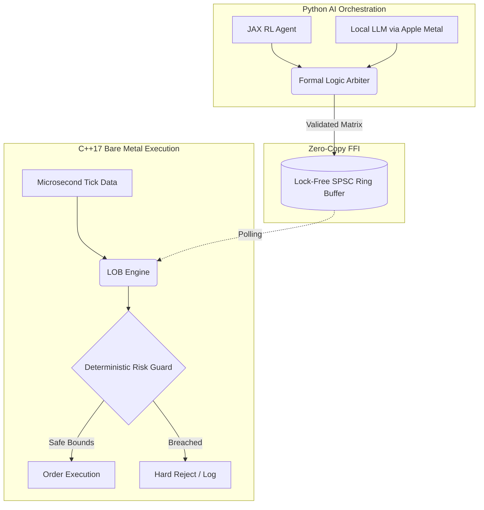
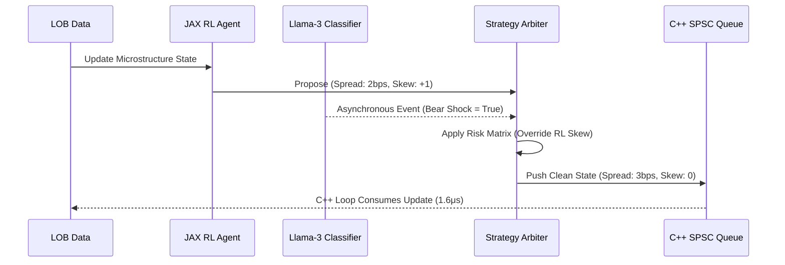

# Handelaar MVP: Deterministic AI Orchestration in High-Frequency Trading

This repository demonstrates a production-grade **Dual-Loop Architecture** designed to safely orchestrate non-deterministic AI models (Large Language Models and Reinforcement Learning) within the strict, microsecond-latency constraints of a high-frequency limit order book (LOB) execution environment.

It proves that complex probabilistic workflows can be integrated into capital-at-risk systems without compromising deterministic safety or hot-path latency.

## Performance Benchmarks
The system achieves sub-2-microsecond median execution latency while continuously updating AI parameters via a lock-free memory bridge.

| Metric | Latency (μs) | Context |
| :--- | :--- | :--- |
| **p50 (Median)** | **1.6670 μs** | Hot-path execution entirely within CPU L1/L2 cache. |
| **Average** | 1.8330 μs | Sustained throughput across 100,000 market ticks. |
| **p95** | 2.2090 μs | Negligible variance under asynchronous AI load. |
| **p99 (Tail)** | **3.2500 μs** | Mathematical proof of zero Python Global Interpreter Lock (GIL) stalling. |

---

## Core Architecture

This project strictly separates execution latency from AI inference via a **Dual-Loop System**, bridged by a highly optimized Foreign Function Interface (FFI).



### 1. The C++ Fast Loop (Execution & Risk)
Written in pure C++17 and aggressively compiled via CMake (`-O3`, `-march=native`, `-flto`), this is the deterministic execution path.
* **Limit Order Book (LOB) Engine:** Ingests memory-mapped micro-ticks and recalculates absolute quoting tiers dynamically.
* **Deterministic Risk Guardrails:** Hard-coded capital-at-risk and positional limits that mathematically intercept and veto any malformed or unsafe parameter requested by the AI.

### 2. The Python Slow Loop (AI Orchestration)
Powered by `uvloop` for maximum asynchronous throughput, this loop manages the independent AI signal generators.
* **Microstructure (JAX RL Agent):** An XLA-compiled policy network that calculates continuous spread and skew adjustments based on numerical LOB state imbalances.
* **Macro-Regime (LLM Classifier):** An asynchronous, local open-weight model (Metal GPU-accelerated via `llama-cpp-python`) that parses unstructured macroeconomic headlines into discrete volatility regimes.

### 3. The Lock-Free Memory Bridge
A custom **Single-Producer Single-Consumer (SPSC) Ring Buffer** exposed via `pybind11`. It utilizes strict cache-line padding (`alignas(64)`) and atomic memory ordering to allow the Python orchestrator to push strategy updates into C++ memory with zero-copy overhead and absolutely zero thread blocking.

### 4. The Formal Logic Arbiter
The "brain" of the Slow Loop. It ingests the conflicting probabilistic signals from the JAX RL agent and the LLM, validates them structurally via `Pydantic` data contracts, and passes them through a formal logic decision matrix. This guarantees that if the LLM detects a macroeconomic shock, the Arbiter overrides the RL agent to instantly widen spreads and protect capital.



---

## Path to Production

While this MVP demonstrates the orchestration architecture on local hardware, deploying this to a tier-one proprietary trading firm requires horizontal scaling and bypassing standard operating system constraints. The following outlines the immediate architectural upgrades for a live production environment:

1. **Kernel Bypass Networking**: Replacing the memory-mapped simulation data with raw UDP multicast ingestion (e.g., ITCH/OUCH protocols). This requires implementing `ef_vi` or `DPDK` on Solarflare NICs to bypass the OS network stack entirely, dropping raw network-to-execution latency into the nanosecond regime.
2. **Hardware Acceleration (FPGA)**: Migrating the C++ Fast Loop (`lob_engine` and `risk_guard`) directly onto an FPGA using SystemVerilog or High-Level Synthesis (HLS). The SPSC queue would transition from a shared-memory struct to a PCIe Gen4 buffer bridging the host CPU (running the AI Arbiter) and the FPGA card.
3. **Distributed AI Inference**: Moving the LLM off local Apple Metal and onto a dedicated, colocated GPU cluster, e.g., NVIDIA H100s. The model would be served via Triton Inference Server and TensorRT-LLM, allowing a single macro-regime classifier to broadcast state updates asynchronously to hundreds of independent LOB engines across different trading symbols simultaneously.
4. **Continuous Reinforcement Learning**: Upgrading the JAX RL agent from static weights to an active, distributed training pipeline via Ray. The agent would continuously train on daily normalized tick data (stored in Apache Parquet/Iceberg on AWS S3), pushing updated policy weights into production at the start of each trading session.

## Build & Execution Instructions

This project requires a UNIX-like environment (macOS/Linux) and a modern C++ compiler (Apple Clang or GCC).

### 1. Environment Setup
```bash
python3 -m venv venv
source venv/bin/activate
pip install -r requirements.txt
```

(Note: To enable Metal GPU acceleration for the LLM on Apple Silicon, use CMAKE_ARGS="-DLLAMA_METAL=on" pip install llama-cpp-python)

### 2. Compile the C++ Core
Build the highly optimised `pybind11` bridge:
```bash
mkdir build && cd build
cmake ../cpp_core
make -j4
cp cpp_core.so ../
cd ..
```

### 3. Run the Hardware Benchmark
Prove the sub-microsecond latency on your local architecture:
```bash
python -m benchmarks.run_latency_test
```

### 4. Code Governance
The repository strictly enforeces `MyPy` static type checking, `Ruff` performance linting, and warning-as-erorrs (`-Werror`) for all C++ components via pre-commit hooks.
```bash
pre-commit install
```
